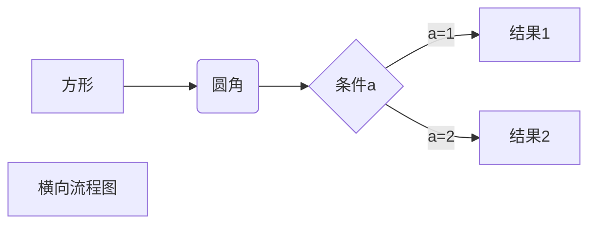

万年历的计算主要基于格里历（即阳历）和儒略历（即农历）两种历法的组合运算，通过数学计算和规则推算，将公历、农历以及二十四节气等整合在一起，形成一个能够长期适用且无需人为调整的日期显示系统。以下是万年历计算的主要步骤和方法：

### 一、闰年的判断

* 根据格里历的规则，每4年有一个闰年，但是整百年不闰，四百年再闰。即能被4整除的年份是闰年，但能被100整除而不能被400整除的年份不是闰年。

### 二、星期几的计算

* 可以通过某一年、某一月、某一日来计算出当天是星期几。这通常利用一个已知的基准日期，如万年历中常用的是1582年10月4日是星期一，然后根据与此基准日期相差的天数进行计算。
* 也可以使用蔡勒（Zeller）公式等历史算法来计算历史上的某一天是星期几。蔡勒公式是一个复杂的数学公式，涉及年份、月份、日期等多个因素，通过计算可以得出星期数。

### 三、农历的转换

* 农历的月份和天数不固定，需要通过一系列复杂的历法运算来确定。万年历中包含了农历的信息，可以通过输入一个阳历日期，计算出对应的农历日期。

### 四、月历的显示

* 根据以上计算结果，可以显示出某一年、某一月的月历，包括阳历和农历的日期信息。在显示时，一般会标记出公历的重要节日和农历的重要节日，以方便用户查看。

### 五、其他因素

* 万年历还考虑了其他天文因素，如二十四节气的变化等，以确保在任何年份都能准确显示日期和对应的传统节日。

综上所述，万年历的计算是一个复杂而精确的过程，它基于多种历法和天文规律进行运算和推算，以确保日期信息的准确性和长期适用性。随着科技的发展和计算机技术的进步，现代万年历已经实现了高度的自动化和智能化，能够为用户提供更加便捷和准确的日期查询服务。

`for i in range(1,100):`

# Git教程
 - fix-B
 - fix-bb
 - 添加pr first-pr
 - 添加pr first-pr
 - 添加pr first-pr
 - 添加pr first-pr
 - 添加pr first-pr
